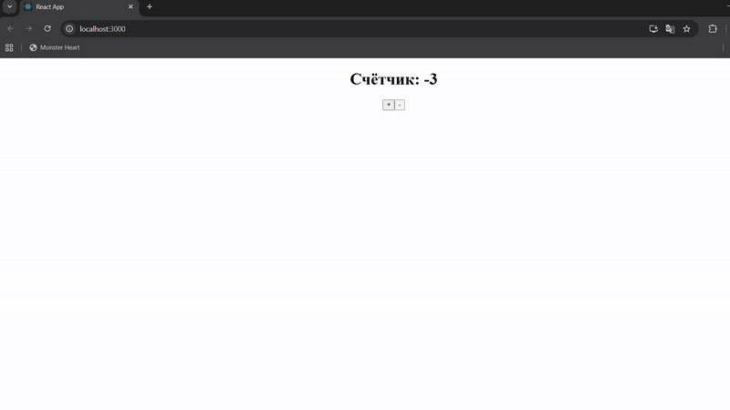

# React Counter

A simple React application with a counter implemented using Redux.

## Features
- Initial counter value is `0`
- `+` button increases the counter by 1
- `-` button decreases the counter by 1

## Demo gif
